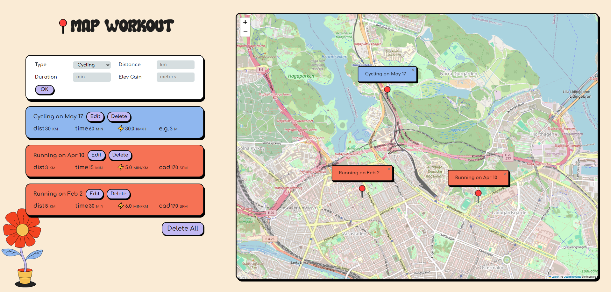

# Map your Workouts

The goal of this application is for to log workouts. The main part of the application is a huge map.
This map is loaded from Leaflet, a popular open-source JavaScript library for creating interactive maps.
The position is automatically obtained by the browser using geolocation.
Data about the workouts is stored in the browser

Live - https://tracking-workouts.netlify.app/

# Features

- Track running and cycling workouts.
- Record distance, duration, and additional details.
- Visualize workouts on an interactive map.
- Edit workouts(you also need to specify a new location on the map).
- Delete workouts.
- Delete all workouts at once (if there are two or more).
- Responsive and user-friendly design (not for mobile ).
